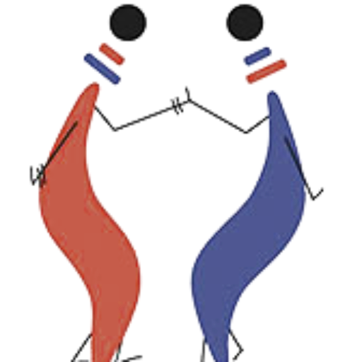

# Collective Project

## Aim 🏹 🙌

- Automation of dairy farm operations in Laravel 6.x (👊 BBIT 3101 @ Strathmore University 👍)
  - Employee records
  - Animal records (details,calving,feeds,medical) 
  - Daily produce
  - Sales
  - Notifications
  - Reporting

#### @Credits
- [Image](http://www.tuko-pamoja.com/)
- [Source 1 ](http://www.dailyfresh.farm/)
- [Source 2](https://www.vectorstock.com/)
- [Design Diagrams](https://www.lucidchart.com/)
